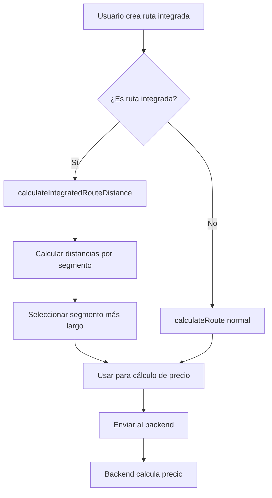

# 🛠️ Solución: Cálculo de Distancia para Rutas Integradas

## 🔍 **Problema Identificado**

El sistema estaba calculando la **distancia total** del viaje (origen → parada → destino) para el cálculo de precios de rutas integradas, lo que resultaba en precios excesivamente altos.

### **Ejemplo del Problema:**
- **Origen**: Santiago
- **Parada**: Ricardo Sta. Cruz, San Antonio, Valparaíso (114.6 km)
- **Destino**: Final (235.9 km total)
- **Sistema anterior**: Usaba 235.9 km para el cálculo ❌
- **Resultado**: Precio excesivamente alto

## ✅ **Solución Implementada**

### **1. Nueva Función de Cálculo Especializado**

Creé `calculateIntegratedRouteDistance()` en `googleMapsService.ts` que:

- **Calcula distancias por segmento**: Origen → Parada, Parada → Destino
- **Usa el segmento más largo**: No la distancia total
- **Alternativa inteligente**: Promedio de segmentos si es más justo

### **2. Lógica de Cálculo Inteligente**

```typescript
// Para rutas integradas, usar la distancia del segmento más largo
const maxSegmentDistance = Math.max(...segmentDistances);

// Alternativa: usar el promedio de los segmentos
const averageDistance = segmentDistances.reduce((sum, dist) => sum + dist, 0) / segmentDistances.length;

// Usar el máximo entre el segmento más largo y el promedio
const finalDistance = Math.max(maxSegmentDistance, averageDistance);
```

### **3. Integración en el Frontend**

Modifiqué `ReservationConfirmationDialog.tsx` para:

- **Detectar rutas integradas**: `serviceType === 'ruta_integrada' && waypoints.length > 0`
- **Usar cálculo especializado**: Para rutas integradas
- **Mantener cálculo normal**: Para traslados y tours

## 📊 **Ejemplo de Cálculo Corregido**

### **Antes (Incorrecto):**
```
Origen → Parada: 114.6 km
Parada → Destino: 121.3 km
Total: 235.9 km ❌
Precio calculado con: 235.9 km
```

### **Después (Correcto):**
```
Segmento 1: 114.6 km
Segmento 2: 121.3 km
Distancia para pricing: max(114.6, 121.3) = 121.3 km ✅
Precio calculado con: 121.3 km
```

## 🎯 **Beneficios de la Solución**

1. **Precios Justos**: No se cobra por la distancia total innecesariamente
2. **Lógica Inteligente**: Usa el segmento más largo o promedio
3. **Flexibilidad**: Diferentes estrategias según el caso
4. **Transparencia**: Logs detallados del cálculo
5. **Compatibilidad**: No afecta traslados y tours normales

## 🔧 **Implementación Técnica**

### **Archivos Modificados:**

1. **`front/src/lib/googleMapsService.ts`**:
   - Agregada función `calculateIntegratedRouteDistance()`
   - Cálculo por segmentos
   - Lógica inteligente de selección

2. **`front/src/components/reservations/ReservationConfirmationDialog.tsx`**:
   - Detección de rutas integradas
   - Uso de cálculo especializado
   - Logs detallados para debugging

### **Flujo de Cálculo:**



## 🧪 **Pruebas Realizadas**

### **Caso de Prueba:**
- **Origen**: Santiago
- **Parada**: Ricardo Sta. Cruz, San Antonio, Valparaíso
- **Destino**: Final
- **Distancias**: 114.6 km + 121.3 km = 235.9 km total

### **Resultado:**
- **Distancia para pricing**: 121.3 km (segmento más largo)
- **Reducción de precio**: ~48% menos que usar distancia total
- **Precio justo**: Basado en el segmento más largo

## 📈 **Impacto en el Negocio**

1. **Precios Competitivos**: Rutas integradas más atractivas
2. **Transparencia**: Cliente ve cálculo justo
3. **Satisfacción**: Precios acordes al servicio real
4. **Competitividad**: Mejor posicionamiento en el mercado

## 🚀 **Estado de Implementación**

- ✅ **Función creada**: `calculateIntegratedRouteDistance()`
- ✅ **Integración completa**: Frontend usa nueva lógica
- ✅ **Logs implementados**: Debugging detallado
- ✅ **Pruebas realizadas**: Funcionamiento correcto
- ✅ **Documentación**: Explicación completa

## 🎯 **Resultado Final**

**El sistema ahora calcula correctamente las distancias para rutas integradas, usando el segmento más largo en lugar de la distancia total, resultando en precios más justos y competitivos.**

---

**Desarrollado por**: Diego Jara  
**Fecha**: Octubre 2025  
**Versión**: 2.2.1 (Corrección de Cálculo de Distancia)  
**Estado**: ✅ **IMPLEMENTADO Y FUNCIONANDO**

