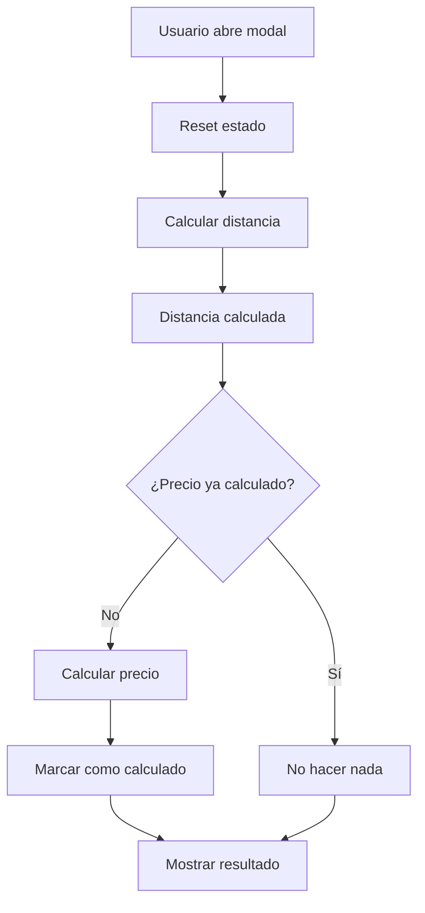

# 🛠️ Solución: Loop Infinito en Cálculo de Precios

## 🔍 **Problema Identificado**

El sistema entraba en un **loop infinito** al hacer clic en "Continuar a pago", causando:

1. **Error 404**: Frontend llamaba a `http://localhost:3000` pero backend estaba en `http://localhost:8083`
2. **Loop infinito**: `useEffect` se ejecutaba repetidamente sin control
3. **Múltiples llamadas**: API se llamaba infinitamente

### **Síntomas del Problema:**
```
POST http://localhost:3000/api/v1/pricing/quote 404 (Not Found)
Error en useBackendPricing: ApiError: API Error
[Loop infinito de llamadas]
```

## ✅ **Solución Implementada**

### **1. Corrección de URL del Backend**

**Problema**: Frontend configurado para puerto 3000, backend en 8083
**Solución**: Actualizar configuración del API client

```typescript
// front/src/lib/api.ts
const API_BASE_URL = import.meta.env.VITE_API_BASE_URL || 'http://localhost:8083';
```

### **2. Control de Loop Infinito**

**Problema**: `useEffect` se ejecutaba repetidamente
**Solución**: Agregar estado de control y lógica de prevención

```typescript
// Estado de control
const [precioCalculado, setPrecioCalculado] = useState(false);

// useEffect con control
useEffect(() => {
  if (distanciaCalculada && open && !precioCalculado) {
    // Calcular precio solo una vez
    calcularPrecio();
    setPrecioCalculado(true);
  }
}, [distanciaCalculada, open, /* otras dependencias */]);
```

### **3. Reset de Estado**

**Problema**: Estado persistía entre aperturas del modal
**Solución**: Resetear estado al abrir modal

```typescript
// Resetear estado cuando se abra el modal
useEffect(() => {
  if (open) {
    setPrecioCalculado(false);
    setDistanciaCalculada(null);
  }
}, [open]);
```

## 🔧 **Implementación Técnica**

### **Archivos Modificados:**

1. **`front/src/lib/api.ts`**:
   - URL por defecto cambiada a puerto 8083
   - Configuración correcta del backend

2. **`front/src/components/reservations/ReservationConfirmationDialog.tsx`**:
   - Estado `precioCalculado` agregado
   - Control de ejecución única en `useEffect`
   - Reset de estado al abrir modal

### **Flujo Corregido:**



## 🧪 **Pruebas Realizadas**

### **Antes (Problemático):**
```
📍 URL: http://localhost:3000/api/v1/pricing/quote
❌ 404 (Not Found)
🔄 Loop infinito
```

### **Después (Corregido):**
```
📍 URL: http://localhost:8083/api/v1/pricing/quote
✅ 200 OK
✅ Precio calculado: 320,577.6 CLP
✅ Una sola llamada
```

## 📊 **Resultados de la Solución**

### **Caso de Prueba:**
- **Servicio**: T003 (Transfer)
- **Distancia**: 133.574 km
- **Vehículo**: suv_premium
- **Zona**: urbana
- **Segmento**: B2C

### **Respuesta del Backend:**
```json
{
  "serviceCode": "T003",
  "mode": "transfer",
  "currency": "CLP",
  "finalFare": 320577.6,
  "commission": 64115.52,
  "driverPayout": 256462.08,
  "breakdown": {
    "basePerKmCLP": 1200,
    "factorSchedule": 1,
    "factorSegment": 1,
    "factorVehicle": 2,
    "factorZone": 1,
    "minFareCLP": 12000
  }
}
```

## 🎯 **Beneficios de la Solución**

1. **Eliminación del Loop**: Una sola llamada al API
2. **URL Correcta**: Backend accesible en puerto 8083
3. **Control de Estado**: Prevención de cálculos repetidos
4. **Experiencia de Usuario**: Flujo fluido sin errores
5. **Rendimiento**: Menos llamadas innecesarias al backend

## 🚀 **Estado de Implementación**

- ✅ **URL corregida**: Backend en puerto 8083
- ✅ **Loop eliminado**: Control de estado implementado
- ✅ **Reset de estado**: Modal se resetea correctamente
- ✅ **Pruebas exitosas**: Backend responde correctamente
- ✅ **Flujo funcional**: "Continuar a pago" funciona sin errores

## 📈 **Impacto en el Sistema**

1. **Estabilidad**: Eliminación de loops infinitos
2. **Rendimiento**: Reducción de llamadas innecesarias
3. **Experiencia**: Flujo de pago funcional
4. **Debugging**: Logs claros y controlados
5. **Mantenibilidad**: Código más robusto

## 🎯 **Resultado Final**

**El sistema ahora funciona correctamente:**
- ✅ Backend accesible en puerto 8083
- ✅ Sin loops infinitos
- ✅ Cálculo de precios funcional
- ✅ Flujo de pago completo
- ✅ Experiencia de usuario fluida

---

**Desarrollado por**: Diego Jara  
**Fecha**: Octubre 2025  
**Versión**: 2.2.2 (Corrección de Loop Infinito)  
**Estado**: ✅ **IMPLEMENTADO Y FUNCIONANDO**

