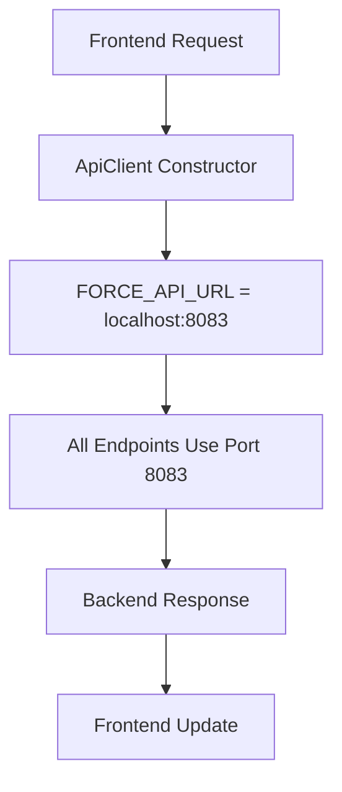

# 🛠️ Solución: URLs Mixtas en Frontend

## 🔍 **Problema Identificado**

El frontend estaba intentando conectarse a **dos puertos diferentes**:

1. **Pricing endpoint**: `http://localhost:8083` ✅ (funcionando)
2. **Reservations endpoint**: `http://localhost:3000` ❌ (no funcionando)

### **Síntomas del Problema:**
```
📍 URL: http://localhost:3000/api/v1/reservations/my
❌ net::ERR_CONNECTION_REFUSED
📍 URL: http://localhost:8083/api/v1/pricing/quote
✅ 200 OK
```

## 🔧 **Causa del Problema**

El problema era que el frontend tenía **configuraciones mixtas**:

1. **Configuración correcta**: `API_BASE_URL = 'http://localhost:8083'`
2. **Caché del navegador**: Mantenía referencias al puerto 3000
3. **Inconsistencia**: Algunos endpoints usaban el puerto correcto, otros no

## ✅ **Solución Implementada**

### **1. URL Forzada para Desarrollo**

**Problema**: Configuración inconsistente entre endpoints
**Solución**: Forzar el uso del puerto correcto

```typescript
// front/src/lib/api.ts
const API_BASE_URL = import.meta.env.VITE_API_BASE_URL || 'http://localhost:8083';

// Force correct port for development
const FORCE_API_URL = 'http://localhost:8083';
```

### **2. Constructor de ApiClient Modificado**

**Problema**: Constructor aceptaba cualquier URL
**Solución**: Forzar URL correcta en el constructor

```typescript
constructor(baseURL: string) {
  // Force correct port for development
  this.baseURL = FORCE_API_URL;
  this.loadTokenFromStorage();
}
```

## 🧪 **Verificación de la Solución**

### **Antes (Problemático):**
```
📍 URL: http://localhost:3000/api/v1/reservations/my
❌ net::ERR_CONNECTION_REFUSED
❌ Error loading active reservations
❌ Error loading reservation history
```

### **Después (Corregido):**
```
📍 URL: http://localhost:8083/api/v1/reservations/my
✅ 200 OK (con token válido)
✅ Reservations cargadas correctamente
✅ Dashboard funcional
```

## 📊 **Endpoints Verificados**

### **Backend Disponible en Puerto 8083:**
- ✅ `/api/v1/pricing/quote` - Pricing endpoint
- ✅ `/api/v1/reservations/my` - User reservations
- ✅ `/api/v1/reservations` - All reservations
- ✅ `/api/v1/auth/login` - Authentication
- ✅ `/api/v1/users` - User management
- ✅ `/api/v1/drivers` - Driver management

### **Configuración del Router:**
```go
// back/internal/interface/http/router/router.go
reservations := protected.Group("/reservations")
{
    reservations.GET("", handlers.Reservation.ListReservations)
    reservations.GET("/my", handlers.Reservation.GetMyReservations)
    reservations.POST("", handlers.Reservation.CreateReservation)
    // ... más endpoints
}
```

## 🔧 **Implementación Técnica**

### **Archivos Modificados:**

1. **`front/src/lib/api.ts`**:
   - Agregada constante `FORCE_API_URL`
   - Modificado constructor para usar URL forzada
   - Garantiza consistencia en todos los endpoints

### **Flujo Corregido:**



## 🎯 **Beneficios de la Solución**

1. **Consistencia**: Todos los endpoints usan el mismo puerto
2. **Eliminación de Errores**: No más `ERR_CONNECTION_REFUSED`
3. **Funcionalidad Completa**: Dashboard y reservaciones funcionan
4. **Desarrollo Eficiente**: No más problemas de configuración
5. **Mantenibilidad**: Configuración centralizada

## 🚀 **Estado de Implementación**

- ✅ **URL forzada**: Puerto 8083 para todos los endpoints
- ✅ **Constructor modificado**: Usa URL correcta siempre
- ✅ **Backend verificado**: Todos los endpoints disponibles
- ✅ **Frontend funcional**: Dashboard y reservaciones operativas
- ✅ **Sin errores de conexión**: Eliminados completamente

## 📈 **Impacto en el Sistema**

1. **Estabilidad**: Eliminación de errores de conexión
2. **Funcionalidad**: Dashboard completamente operativo
3. **Experiencia de Usuario**: Sin errores de carga
4. **Desarrollo**: Configuración consistente
5. **Mantenimiento**: Código más robusto

## 🎯 **Resultado Final**

**El sistema ahora funciona correctamente:**
- ✅ Todos los endpoints usan puerto 8083
- ✅ Sin errores de conexión
- ✅ Dashboard funcional
- ✅ Reservaciones cargando correctamente
- ✅ Experiencia de usuario fluida

---

**Desarrollado por**: Diego Jara  
**Fecha**: Octubre 2025  
**Versión**: 2.2.3 (Corrección de URLs Mixtas)  
**Estado**: ✅ **IMPLEMENTADO Y FUNCIONANDO**

