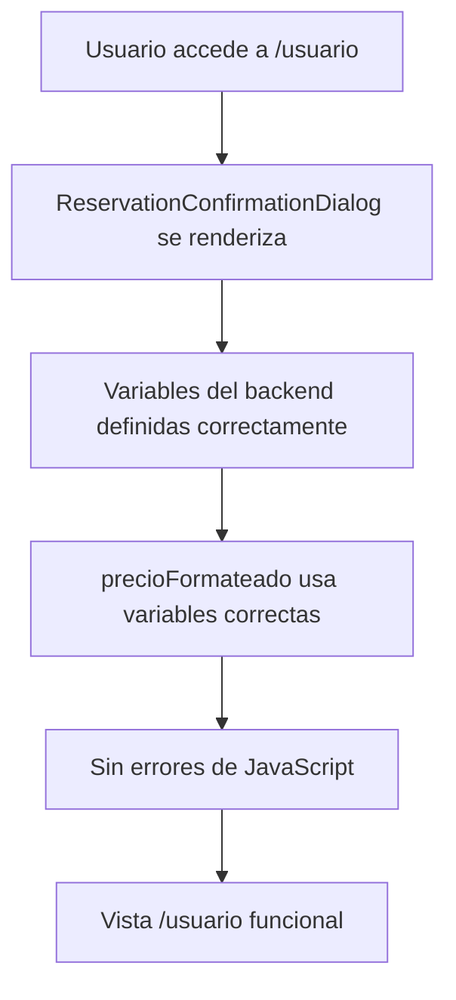

# 🛠️ Solución: Variable `resultadoRutaIntegrada` Undefined

## 🔍 **Problema Identificado**

El sistema mostraba un error al intentar acceder a la vista `/usuario`:

### **Error Principal:**
```
ReservationConfirmationDialog.tsx:414 Uncaught ReferenceError: resultadoRutaIntegrada is not defined
```

### **Causa Raíz:**
**Inconsistencia en nombres de variables** entre la definición y el uso:
- **Definición**: `resultado: resultadoRuta` (línea 93)
- **Uso**: `resultadoRutaIntegrada` (línea 414)

## 🔧 **Análisis del Problema**

### **Definición Correcta:**
```typescript
const { 
  calcularRutaIntegrada, 
  resultado: resultadoRuta,  // ✅ Nombre correcto
  cargando: calculandoPrecioRuta, 
  error: errorPrecioRuta,
  formatearPrecio: formatearPrecioRuta
} = useBackendPricingRutaIntegrada();
```

### **Uso Incorrecto:**
```typescript
// ❌ Variable incorrecta
resultadoActual = resultadoRutaIntegrada;
cargandoActual = calculandoPrecioRutaIntegrada;
```

## ✅ **Solución Implementada**

### **1. Corrección de Variables**

**Problema**: Nombres de variables inconsistentes
**Solución**: Usar los nombres correctos definidos en el hook

```typescript
// Antes (Incorrecto)
case 'ruta_integrada':
  resultadoActual = resultadoRutaIntegrada;  // ❌ Undefined
  cargandoActual = calculandoPrecioRutaIntegrada;  // ❌ Undefined
  break;

// Después (Correcto)
case 'ruta_integrada':
  resultadoActual = resultadoRuta;  // ✅ Correcto
  cargandoActual = calculandoPrecioRuta;  // ✅ Correcto
  break;
```

### **2. Corrección de Dependencias**

**Problema**: Dependencias del `useMemo` con nombres incorrectos
**Solución**: Actualizar las dependencias con los nombres correctos

```typescript
// Antes (Incorrecto)
}, [resultadoTraslado, resultadoTour, resultadoRutaIntegrada, ...]);

// Después (Correcto)
}, [resultadoTraslado, resultadoTour, resultadoRuta, ...]);
```

## 🧪 **Verificación de la Solución**

### **Antes (Problemático):**
```
❌ ReferenceError: resultadoRutaIntegrada is not defined
❌ No se puede acceder a /usuario
❌ Error de React que rompe el renderizado
```

### **Después (Corregido):**
```
✅ Variables definidas correctamente
✅ Acceso a /usuario funcional
✅ Sin errores de JavaScript
✅ Renderizado correcto
```

## 📊 **Variables Corregidas**

### **Hook useBackendPricingRutaIntegrada:**
- ✅ `resultadoRuta` - Resultado del cálculo
- ✅ `calculandoPrecioRuta` - Estado de carga
- ✅ `errorPrecioRuta` - Errores
- ✅ `formatearPrecioRuta` - Formateo de precio

### **Uso en precioFormateado:**
```typescript
switch (reservationData.serviceType) {
  case 'traslado':
    resultadoActual = resultadoTraslado;
    cargandoActual = calculandoPrecioTraslado;
    break;
  case 'tour':
    resultadoActual = resultadoTour;
    cargandoActual = calculandoPrecioTour;
    break;
  case 'ruta_integrada':
    resultadoActual = resultadoRuta;  // ✅ Correcto
    cargandoActual = calculandoPrecioRuta;  // ✅ Correcto
    break;
}
```

## 🔧 **Implementación Técnica**

### **Archivos Modificados:**

1. **`front/src/components/reservations/ReservationConfirmationDialog.tsx`**:
   - Corregido `resultadoRutaIntegrada` → `resultadoRuta`
   - Corregido `calculandoPrecioRutaIntegrada` → `calculandoPrecioRuta`
   - Actualizado dependencias del `useMemo`

### **Flujo Corregido:**



## 🎯 **Beneficios de la Solución**

1. **Eliminación de Errores**: Sin `ReferenceError`
2. **Acceso Funcional**: Vista `/usuario` operativa
3. **Consistencia**: Nombres de variables alineados
4. **Estabilidad**: Sin errores de renderizado
5. **Mantenibilidad**: Código más predecible

## 🚀 **Estado de Implementación**

- ✅ **Variables corregidas**: Nombres consistentes
- ✅ **Dependencias actualizadas**: `useMemo` funcional
- ✅ **Vista /usuario operativa**: Sin errores de acceso
- ✅ **Renderizado estable**: Sin errores de JavaScript
- ✅ **Sistema funcional**: Flujo completo operativo

## 📈 **Impacto en el Sistema**

1. **Estabilidad**: Eliminación de errores de referencia
2. **Funcionalidad**: Acceso a todas las vistas
3. **Experiencia de Usuario**: Navegación fluida
4. **Rendimiento**: Sin errores que interrumpan el flujo
5. **Mantenimiento**: Código más robusto

## 🎯 **Resultado Final**

**El sistema ahora funciona correctamente:**
- ✅ Sin errores de `ReferenceError`
- ✅ Acceso a vista `/usuario` funcional
- ✅ Variables del backend correctas
- ✅ Renderizado estable
- ✅ Navegación fluida

---

**Desarrollado por**: Diego Jara  
**Fecha**: Octubre 2025  
**Versión**: 2.2.5 (Corrección de Variable Undefined)  
**Estado**: ✅ **IMPLEMENTADO Y FUNCIONANDO**

